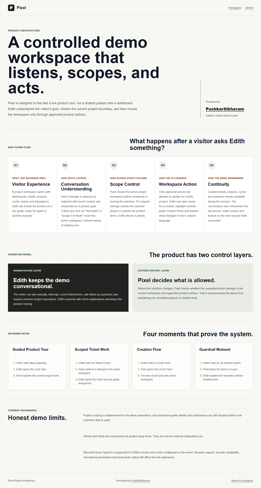

# Pixel Product Architecture

**Developed by [PushkarSikharam](https://github.com/PushkarSikharam)**

Pixel is an adaptive product demo workspace guided by Edith, a conversational assistant. The system is built to prove a specific product idea: a visitor should be able to speak or type naturally, and the product should move to the right place without giving the assistant unrestricted control.

The matching in-app view is available at `/architecture`.

## What Pixel Does

Pixel presents a scoped project workspace with dashboards, tickets, projects, cycles, teams and integrations. A reviewer can ask Edith to show sprint planning, open a ticket, create work, assign ownership, inspect a project, explore team capacity, or ask about integrations.

Edith is not just answering text. She is guiding the workspace. When the request is valid, Pixel updates the visible product. When the request is outside the active project or outside the demo product, Edith refuses clearly and keeps the session grounded.

## How The Product Works

The flow has five parts:

1. The visitor asks through chat or voice.
2. Edith interprets the request using the current workspace, recent conversation and active selection.
3. Pixel checks whether the request belongs to the selected project workspace.
4. An approved action moves the interface, opens a form, focuses a record, or highlights the relevant control.
5. The response is shown back to the visitor and the session context is updated for follow-up questions.

This is what allows natural requests like:

- "Show sprint planning"
- "Open Maya's ticket"
- "Assign it to Noah"
- "Create a ticket for Lucifer"
- "Where do I connect GitHub?"
- "Open Salesforce"

The important behavior is not only the answer. The important behavior is whether the product moves correctly, remembers context, and refuses the wrong thing.

## Control Model

Pixel has two layers.

The human-facing layer is Edith. She keeps the conversation short, natural and demo-oriented. She explains what she is doing, reacts to corrections, and handles follow-up language like "that ticket," "her issue," or "the GitHub one."

The system-control layer decides what Edith is allowed to do. This layer keeps the demo inside the selected product and selected project. It prevents open-ended browsing behavior and limits actions to known product operations.

That separation is the core architecture decision. Edith can guide, but Pixel controls.

## Project Scoping

Pixel supports multiple project workspaces in the demo. The selected workspace determines what the dashboard shows, which tickets are available, which team members can be assigned and what Edith is allowed to answer.

If a visitor asks about the active project, Edith can respond and move the UI. If the visitor asks for another project's private work, the system should treat it as out of scope. This is the product behavior the reviewer asked for: teams should see their own project details, not everyone else's.

The current demo proves this product pattern. Before real private data is used, production identity and permission checks must be added.

## Conversation And Memory

Edith keeps lightweight session memory so the conversation can continue naturally. The assistant tracks the most recent person, ticket, project and feature discussed. This lets the visitor say "assign it to Noah" after opening Maya's ticket, instead of repeating the full ticket name.

The assistant also asks clarifying questions when a request is incomplete. For example, "create a ticket" should lead to the right creation flow instead of a generic capability response.

## Creation Workflows

Pixel supports professional creation flows for the demo workspace:

- Tickets can be created with title, description, assignee, priority, status, project and cycle.
- Projects can be created with owner, status, target date and project context.
- Cycles can be created with name, dates, focus and team capacity.
- Team members can be added so newly created work can be assigned to them.

Creation matters because it makes the demo feel like a usable product, not a static prototype.

## Voice And Interruption

Voice is designed as a parallel input path to chat. The visitor should be able to speak naturally, pause for a few seconds, and then hear Edith respond. If the visitor interrupts while Edith is speaking, playback should stop and the new request should take priority.

The current system supports the voice interaction shell, interruption behavior and server-side Microsoft Azure Speech synthesis for Edith when Azure credentials are configured. Browser support, microphone permission, speaker output and provider availability can affect the experience.

Azure speech recognition and production-grade real-time voice are still separate follow-up steps.

## Integrations

GitHub and Slack are represented as guided product flows. Edith can explain where they live, why a team would connect them and what kind of workflow they enable.

These are demo integrations. They do not perform real external authorization or data synchronization yet.

## Guardrails

Pixel should refuse actions that are outside the product demo or outside the active project workspace. A clean refusal is part of the user experience.

For example, asking to open Salesforce should not make the product pretend it has Salesforce access. Edith should say that Pixel can only demonstrate supported Pixel workflows in this session.

## Current Limits

This is a strong demo system, not a production multi-tenant SaaS product yet.

The remaining production gaps are:

1. Real user identity and membership checks.
2. Server-enforced project permissions for every read and write.
3. Real external integrations for GitHub, Slack or other tools.
4. Provider-level speech recognition and deeper real-time voice tuning.
5. Stronger operational controls such as audit logs, backups, monitoring and rate limits.
6. More adaptive reasoning if the product is pitched as a full AI agent rather than a controlled demo agent.

## Reviewer Summary

Pixel demonstrates the key idea well: a conversational guide can control a product demo without becoming an unrestricted chatbot.

The strongest parts are scoped workspace behavior, guided creation flows, contextual follow-ups, interruption handling and clean refusal of unsupported requests.

The honest next step is production-grade access control and deeper real-device voice testing.
